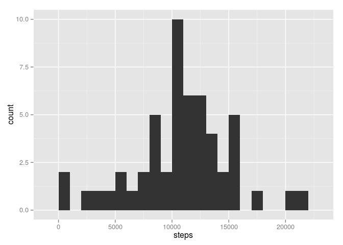
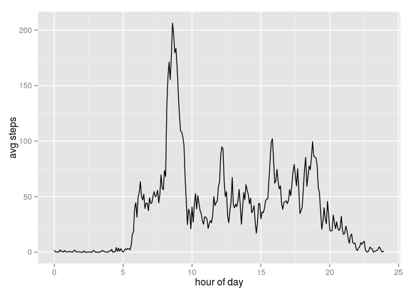
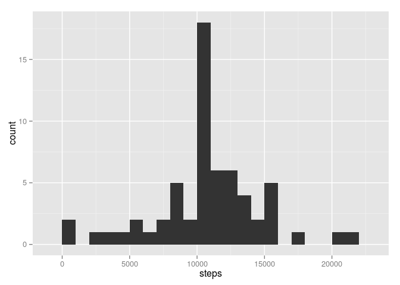
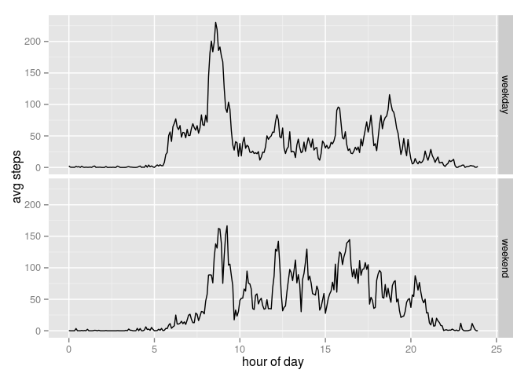

# Reproducible Research: Peer Assessment 1

## Loading and preprocessing the data

I will be using the `dplyr` package for manipulating data and
`ggplot2` for plotting. When I read in the data I just like to ensure
that the dates are truly R dates and not just factors. Also, define a
simple function that will ensure that numeric output does not come out
in scientific notation.


```r
require("dplyr")
require("ggplot2")

act_data <- function(file = "activity.csv")
  read.csv(file, colClasses = c(date = "POSIXct"))

f   <- function(x) format(x, scientific = FALSE)
act <- act_data()
```

## What is mean total number of steps taken per day?

Calculate the total number of steps in each day, but ignore those days
for which all the step values are missing.


```r
steps_per_day <- function(act = act_data(), na.rm = TRUE) {
  sum_or_NA <- function(x)
                 if(all(is.na(x))) NA else sum(x, na.rm = na.rm)
  act %>%
    group_by(date) %>%
    summarise(steps = sum_or_NA(steps))}

steps_histogram <- function(spd = steps_per_day(), binwidth = 1000)
  ggplot(spd) +
    geom_histogram(aes(steps), binwidth = binwidth)

spd        <- steps_per_day(act)
mean_spd   <- mean(spd$steps, na.rm = TRUE)
median_spd <- median(spd$steps, na.rm = TRUE)
```

After counting the number of steps in each day we find

 - mean number of steps per day: 10766.19
 - median number of steps per day: 10765

The histogram of steps per day looks as follows:
 

## What is the average daily activity pattern?

For each interval we can average the number of steps across all days.


```r
avg_per_interval <- function(act = act_data(), na.rm = TRUE)
  act %>%
    group_by(interval) %>%
    summarise(steps = mean(steps, na.rm = na.rm))

api     <- avg_per_interval(act)
max_int <- api$interval[which.max(api$steps)]
```

The interval with the greatest average number of steps is
835.

Now the `interval` variable is an integer that identifies the starting
minute of the day for a 5-minute interval. It is of the form hhmm
where the hh digits give the hour and the mm digits give the minutes
after the hour. (There are no leading zeros however.) The code below
transforms the interval representation into something that is more
like a time stamp so that when we plot the step averages as a function
of time equal horizontal displacements correspond to equal time
increments.

If we had just used `interval` directly then for example the
difference between 50 and 55 would be 5---as it should be---but the
difference between 55 and 100 would be 45---when it should also be 5.


```r
interval_to_hour <- function(i) (i %/% 100) + (i %% 100)/60

interval_plot <- function(api = avg_per_interval())
  ggplot(api) +
    geom_line(aes(interval_to_hour(interval), steps)) +
    xlab("hour of day") + ylab("avg steps")

interval_plot(api)
```

 

## Imputing missing values

The `summary` function shows that the only missing values are `steps`
values and that there are 2304 of them.


```r
summary(act)
```

```
##      steps             date                        interval     
##  Min.   :  0.00   Min.   :2012-10-01 00:00:00   Min.   :   0.0  
##  1st Qu.:  0.00   1st Qu.:2012-10-16 00:00:00   1st Qu.: 588.8  
##  Median :  0.00   Median :2012-10-31 00:00:00   Median :1177.5  
##  Mean   : 37.38   Mean   :2012-10-31 00:25:34   Mean   :1177.5  
##  3rd Qu.: 12.00   3rd Qu.:2012-11-15 00:00:00   3rd Qu.:1766.2  
##  Max.   :806.00   Max.   :2012-11-30 00:00:00   Max.   :2355.0  
##  NA's   :2304
```

The function below returns the activity data with missing values
imputed. Where `steps` are missing for a particular day and interval
it sets that value to the average number of steps for that interval.


```r
imputed_data <- function(act = act_data(),
                         api = avg_per_interval(act)) { 
  i            <- is.na(act$steps)
  act$steps[i] <- api$steps[match(act$interval[i], api$interval)]
  act}

imp         <- imputed_data(act, api)
spdi        <- steps_per_day(imp)
mean_spdi   <- mean(spdi$steps, na.rm = TRUE)
median_spdi <- median(spdi$steps, na.rm = TRUE)
```

 - The mean number of steps per day with imputation is:
   10766.19. (It had been 10766.19 without imputation.)
 - The median number of steps per day with imputation is:
   10766.19. (It had been 10765.)

The histogram of imputed steps per day looks as follows:
 

Under the imputed regime the estimates of the total daily number of
steps cannot decrease because now we are counting the imputed values
in addition to the real ones.

## Are there differences in activity patterns between weekdays and weekends?

We have separated out the work of creating the weekday/weekend factor
into a discreet function. The plotting routine calls it before finding
the average number of steps per interval. As before we turn the
interval into a timestamp.


```r
create_daytype <- function(d) {    # argument d is a date
  r <- rep("weekend", length(d))
  r[is.na(match(weekdays(d), c("Saturday", "Sunday")))] <- "weekday"
  factor(r)}
  
daytype_plot <- function(imp = imputed_data()) {
  api <- data.frame(imp, daytype = create_daytype(imp$date)) %>%
    group_by(daytype, interval) %>%
    summarise(steps = mean(steps))
  interval_plot(api) + facet_grid(daytype ~ .)}
```

Here is the resulting plot on the imputed data:
 
